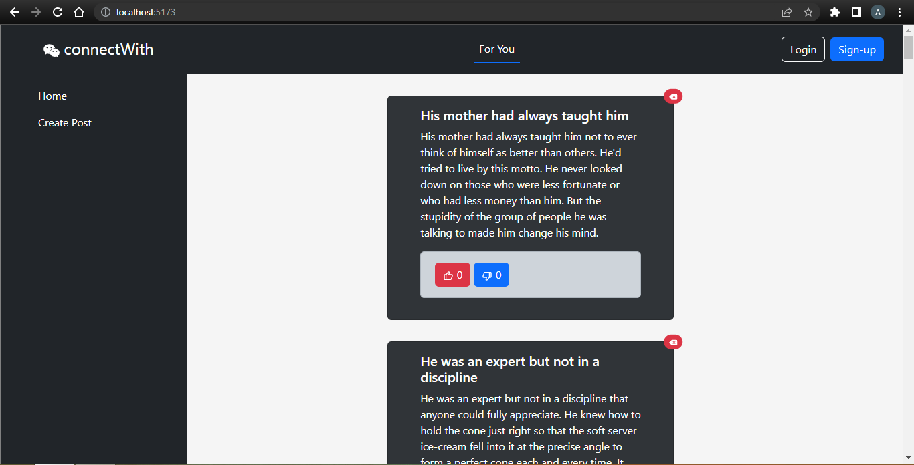

# connectWith

**connectWith** is a status uploading web application built using ReactJS, Vite, Bootstrap, and DummyJSON APIs. The application allows users to create and view status updates with a simple and intuitive interface.



## Features

- **Home Page:** Displays a list of status updates, including those generated automatically via an API from DummyJSON.
- **Create Post Page:** Allows users to create a new post by entering a userId, title, and status (caption). New posts are created using a separate API from DummyJSON.

## Tech Stack

- **Frontend:**
  - ReactJS
  - Vite
  - Bootstrap

- **Backend/API:**
  - DummyJSON (for auto-generated and user-created posts)

## Installation

To get a local copy of the project up and running, follow these steps:

### Prerequisites

Ensure you have the following installed on your machine:
- Node.js
- npm or yarn

## Acknowledgements

- [DummyJSON](https://dummyjson.com) for providing the API used in this project.
- [ReactJS](https://reactjs.org)
- [Vite](https://vitejs.dev)
- [Bootstrap](https://getbootstrap.com)

## API Example

To fetch all the existing posts, use the following API call: ('https://dummyjson.com/posts')

## API Example

To add a new post from the user, use the following API call: ('https://dummyjson.com/posts/add')

### Clone the Repository

```bash
git clone https://github.com/your-username/connectWith.git
cd connectWith
